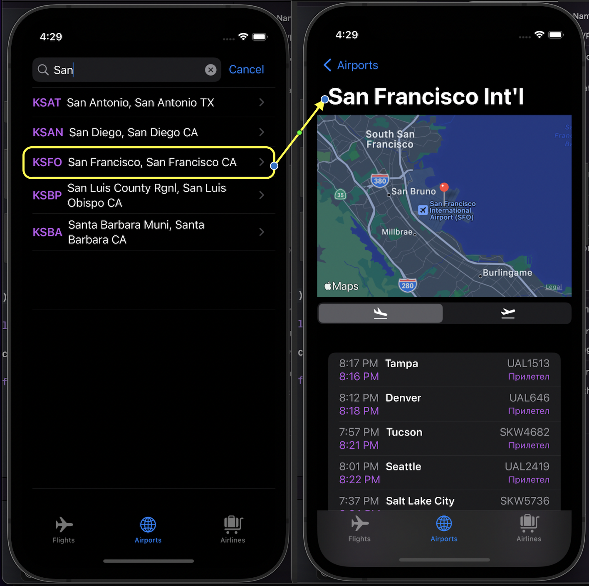
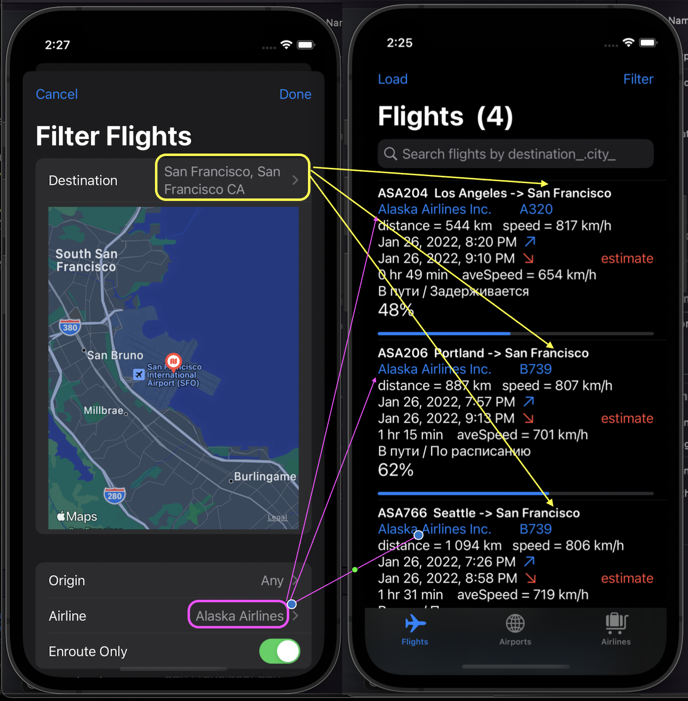
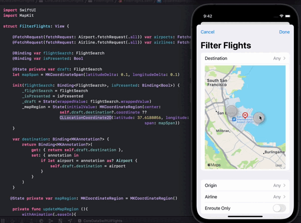
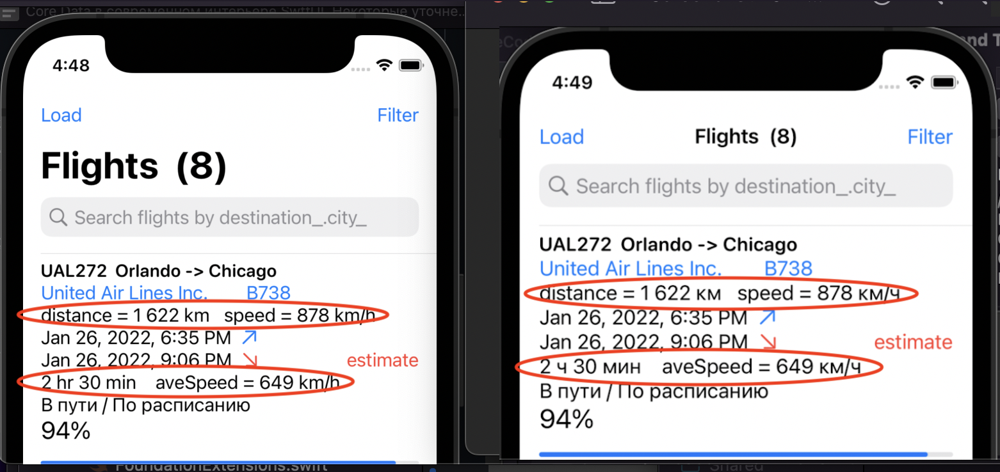

# CoreDataSwiftUIFlights

Приложение CoreDataSwiftUI показывает, как достичь комфортной работы Core Data и SwiftUI в iOS 15 с реальными взаимосвязанными объектами - 
рейсами ``Flight``, аэропортами ``Airport`` и авиакомпаниями ``AirLine``. Благодаря My AeroAPI мы получаем эти данные на сервере [FlightAware](https://ru.flightaware.com/) в формате JSON и размещаем их в Core Data, чтобы предоставить пользователю разнообразные средства для просмотра и выборки этих данных из Core Data по различным критериям.


#### Поиск аэропорта по имени и детальная информация о нем :



#### Фильтрация рейсов ``Flights`` по сложному критерию, включающему аэропорт назначения ``Destination``, аэропорт отправления ``Origin``, авиакомпанию ``Airline`` и нахождение в пути Enroute Only:



Это сильно упрощенная модификация реального приложения [Enroute из стэнфордских курсов CS193P 2020](https://cs193p.sites.stanford.edu/2020),
которое оперативно подкачивает данные с сервера [FlightAware](https://ru.flightaware.com/) в базу данных Core Data. В отличие от стэнфордского приложения Enroute, приложение CoreDataSwiftUIFlights не подкачивает оперативно данные с сервера [FlightAware](https://ru.flightaware.com/)(это возможно только для платного аккаунта), а просто пассивно считывает JSON информацию из файлов с рейсами FLIGHT.json, аэропортами AIRPORTS.json  и авиакомпаниями AIRLINES.json, заполненными информацией с того же сервера [FlightAware](https://ru.flightaware.com/) с использованием бесплатного аккаунта My AeroAPI и также запоминает данные в Core Data. Приложение CoreDataSwiftUI основное внимание уделяет отображению в SwiftUI самих объектов Core Data (рейсов ``Flight``, аэропортов ``Airport`` и авиакомпаний ``AirLine``)с их взаимосвязями типа *one-to-many*, а также выборке данных по разнообразным запросам пользователя, начиная от простейших с использованием SwiftUI модификатора ``.seachable`` и заканчивая сложными запросами с использованием Picker и возможностью указания на карте ``Map`` аэропорта назначения Destination. При этом можно использовать как "родную" SwiftUI ``Map``, так и интегрированную в SwiftUI UIKit карту ``MapKit``. 

[]

В этом нам существенную помощь оказывают классы ``class``, которые являются подклассами ``subclass NSManagedObject``, сгенерированные Xcode “за кулисами” для каждого такого объекта Core Data, и представляющие собой миниатюрные``ViewModels``, реализующие протоколы ``ObservableObject`` и ``Identifiable``.  А также динамически настраниваемый в SwiftUI запрос к Core Data ``@FetchRequest``. Именно таким образом Apple  удалось научить Core Data объекты превосходно „играть“ на поле „реактивности“ SwiftUI.

Но не только это. Как ни крути, а фреймворк Core Data, разработанный Apple для постоянного хранения данных на своих платформах, очень эффективно работающий даже с очень большими объемами данных, был разработан с использование еще старого языка программирования Objective-C, когда языка программирования Swift вообще не было в проекте, и, конечно, это отразилось на его API. Core Data оперирует с взаимосвязями объектов в виде множеств ``NSSet`` языка программирования Objective-C, а вовсе не с современными множествами ``Set`` языка программирования Swift. Из соображений надежности Core Data объекты в базе данных Сore Data хранятся как  ``Optional``, хотя таковыми иногда не являются, кроме того, это совершенно другого рода ``Optional``, чем ``Optional`` в языке программирования Swift, то есть имеет место некоторое столкновения ``Optionals`` в  Core Data и ``Optionals`` в Swift. Поэтому в расширениях `extension` наших миниатюрных ``ViewModels``для подклассов ``NSManagedObject`` мы используем “синтаксический сахар”, который умело маскирует эти шероховатости, так что в SwiftUI вы будете иметь дело с привычными языку программирования Swift ``Optionals`` и множествами ``Set``.

Например, фрагмент кода для расширения ``extension`` класса  ``Airport``. 
Мы видим, что код аэропорта  ``icao``, его город базирования ``city`` являются НЕ ``Optional`` в отличие от переменных  ``icao_`` и ``city_``, которые генерируются Xcode. То же самое с взаимосвязями: вылетами  ``flightsFrom`` и прилетами ``flightsTo`` из этого аэропорта, они являются Swift множествами ``Set`` в отличие от множеств ``NSSet flightsFrom_ `` и ``flightsTo_``, сгенерированными  Xcode "за кулисами". Это сильно упрощаеь их использование в SwiftUI при проектировании пользовательского интерфейса.

```swift
extension Airport: Comparable {
.  .  .  .  .  .  .  .  .  .  .  .  .  .  .
 var icao: String {
        get { icao_! } // TODO: maybe protect against when app ships?
        set { icao_ = newValue }
    }
    
    public var id: String { icao }
    
    var city: String {
        get { city_ ?? " "}
        set { city_ = newValue }
    }
    
    var nameAirport: String {
        get { name ?? " "}
    }
  
    var flightsFrom: Set<Flight> {
        get { (flightsFrom_ as? Set<Flight>) ?? [] }
        set { flightsFrom_ = newValue as NSSet }
    }
    
    var flightsTo: Set<Flight> {
        get { (flightsTo_ as? Set<Flight>) ?? [] }
        set { flightsTo_ = newValue as NSSet }
    }
    
    var friendlyName: String {
        Self.friendlyName(name: name ?? " ", location: city + " " + (state ?? " "))
    }
    }
   ```
Нащши миниатюрные ``ViewModels`` для объектов Core Data в виде подклассов ``subclass NSManagedObject``, сгенерированные Xcode “за кулисами”, нужны и еще для одной роли  ``ViewModels``, которая заключается в том, что они преобразуют информацию, поступающую из Model, к виду, удобному для отображения в View. Эта задача особеннно актуальна для нашего приложения, потому что сервис [FlightAware](https://ru.flightaware.com/) предоставляет нам полетную информацию вовсе в не привычной для нас СИ единицах измерения: дальность в футах (foots), в узлах (knots). Мы естественно хотим отображать на нашем UI значения полетных параметров в СИ единицах измерения: дальность - в километрах km, скорость - в километрах/час km/h. 

```swift
import CoreData

extension Flight: Comparable {
.  .  .  .  .  .  .  .  .  .  .  .
var airlineCode: String { String(ident.prefix(while: { !$0.isNumber })) }
    
    var duration: Double {Double(Int(estimatedOn.timeIntervalSince(estimatedOff!))) / 3600.0}
    var durationTime: Measurement<UnitDuration> {Measurement(value: duration,
                                                             unit: UnitDuration.hours)}
    
    // ----------Дальность полета и скорость полета по приборам (ППП)
    var distance: Measurement<UnitLength> {Double(routeDistance).convert(from: .miles,
                                                                         to: .kilometers)}
    var distanceInKm: String {distance.format()}
    var speedInKmHours: String {Double(filedAirspeed).convert(from: .knots,
                                                              to: .kilometersPerHour).format()}
    var distanceAndSpeed: String {"distance = " + distanceInKm + "   speed = " + speedInKmHours}
    
    // ----------Длительность полета и средняя скорость полета ------------
    var durationHoursMin: String {estimatedOn.timeIntervalSince(estimatedOff!).hourMinuteUnit}
    var averageSpeed:String { (distance / durationTime).converted(to: .kilometersPerHour).format()}
    var hoursAndSpeed: String {durationHoursMin +  "    aveSpeed = " + averageSpeed}
    
    var depature: Date {actualOff ?? estimatedOff!}
    var arrival: Date {actualOn ?? estimatedOn}
```

Для этого нам не понадобилось никакой дополнительный код, так как в Swift уже есть встроенная система единиц измерения длины, скорости и продолжительности соответственно ```UnitLength```, ```UnitSpeed``` и ```UnitDuration```, и мы можем и мы можем легко преобразовывать значения в одних единицах измерения в значения в других единицах измерения, подписывая эти значения соответствующими единицами измерения в определенном формате, которые могут также локализоваться в зависимости от страны. 



За работу с физическими значениями и их единицами измерения в iOS отвечают объекты ```Measurement``` - это отдельная тема, о которой можно почитать [здесь] (https://oleb.net/blog/2016/07/measurements-and-units/).


